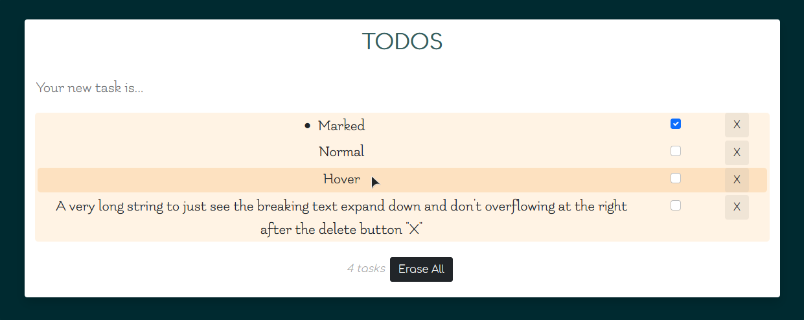

# To-do list with React and Fetch

After doing the React todo list we had to add some functionalities as an API and an `Erase all` button, which I had previously added. 

### Previoulsy: https://github.com/AslanSN/todo-list ...
> Exercise where we had to copy with our own code this template: 
>
>
>
>
> #### My code
> So I did all the functions shown plus a dark button to erase all the task list. 
> I used only JavaScript with React and Bootstrap.
> There is the result:
>
> [](http://https://raw.githubusercontent.com/AslanSN/todo-list/master/src/TodoList.png "Aslan's To-do List")
>
> All the functions are working and the familly font for the main list and the input is _Flamenco_ in honor of my teacher @Manu Martinez.

## Now
### My code

I added two useEffect() functions that marks up when they must be called. With a general flag added for the `PUT` not to act just after the `GET` -- it's a more efficient way to control loadings on the server.

- The first one is for the screen's `onLoad` which has the `GET fetch` that adds a `+1` to the `flag var`.
```JavaScript
useEffect(() => {
		fetch(url, {
			method: "GET",
			headers: {
				Accept: "application/json"
			}
		})
			.then(response => response.json())
			.then(data => setList(data))
			.then(() => setUsed(+1))
			.catch(err => setError(new ErrorObj(true, String(err))));
	}, []);
```

- The second is for when the `list` of `Task`s is changed it has a `PUT fetch` that saves the `task's list` on the `Server` with a `ternary conditional` to be initiated. Due to that the first change ever in the program life will not `"wake up"` the `PUT` loading.

```JavaScript
useEffect(() => {
		used >= 1
			? fetch(url, {
					method: "PUT",
					body: JSON.stringify(list),
					headers: {
						"Content-Type": "application/json"
					}
			  }).catch(err => setError(new ErrorObj(true, String(err))))
			: null;
	}, [list]);
```

## Output



------------


### Run the code
Open your workspace cloning or, if you have GitPod installed, just click the button.

Then **install node.js**. For this you must type this in your **terminal**:

`npm install`

Now just run it typing:

`npm run start`

------------

_Thank you for reading,_

_**AslanSN**_
